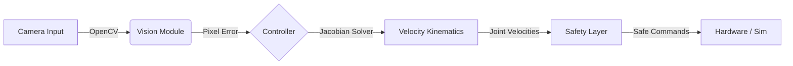

# Sim2Real Kinematics & Visual Servoing Stack (5-DOF)

[](https://www.python.org/)
[](https://mujoco.org/)
[](https://github.com/huggingface/lerobot)
[](LICENSE)

**A modular, safety-critical control stack for 5-DOF robotic manipulators (SO-100/101).**

This project implements a complete **Sim2Real pipeline**, featuring an analytical kinematics engine derived from scratch, high-fidelity MuJoCo simulation, and a real-time visual servoing controller deployed on physical hardware via the Hugging Face LeRobot framework.

---

## 📸 Demo

| **Simulation (MuJoCo)** | **Real World (SO-100)** |
|:-----------------------:|:-----------------------:|
| *[INSERT GIF OF SIMULATION HERE]* | *[INSERT GIF OF REAL ROBOT HERE]* |
| *Verifying Jacobian control in physics engine* | *Deploying same code to hardware* |

---

## 🚀 Key Engineering Features

### 1. Custom Kinematics Engine
* **Analytical Derivation:** Implemented Forward and Velocity Kinematics from scratch using **SymPy** and **Denavit-Hartenberg (DH)** parameters (not a black-box solver).
* **Jacobian Control:** Uses a symbolic Jacobian matrix compiled to a fast NumPy function for real-time differential inverse kinematics.

### 2. Safety-Critical Control Layer
* **Singularity Avoidance:** Real-time monitoring of the Manipulability Index ($w = \sqrt{\det(JJ^T)}$) to prevent erratic motion near singular configurations.
* **Predictive Joint Limits:** A safety filter anticipates joint limit violations *before* they happen and clamps velocity vectors dynamically.

### 3. Closed-Loop Visual Servoing
* **Computer Vision:** Integrated OpenCV pipeline for real-time object detection (Color Thresholding + Contour Analysis).
* **Visual Feedback Loop:** Implemented a Proportional (P) controller mapping pixel-space error directly to joint-space velocities via the pseudo-inverse Jacobian.

### 4. Professional Software Architecture
* **Sim2Real Parity:** The exact same controller code runs both the MuJoCo simulation and the physical robot, enabling safe offline testing.
* **Config-Driven:** All hardware parameters (ports, gains, limits) are decoupled from code in YAML configuration files.

---

## 🏗️ System Architecture



## 🛠️ Installation

### Prerequisites
- **OS:** Linux (Ubuntu 20.04/22.04 recommended) or Windows (WSL2 supported for Sim).
- **Hardware:** SO-100/101 Robot Arm, USB Camera.

### 1. Clone & Environment Setup
We use conda to manage dependencies and a robust environment.yml for reproducible builds.

```bash
# Clone the repository
git clone [https://github.com/YOUR_USERNAME/lerobot-mujoco-kinematics.git](https://github.com/YOUR_USERNAME/lerobot-mujoco-kinematics.git)
cd lerobot-mujoco-kinematics

# Create isolated environment (Installs LeRobot, MuJoCo, OpenCV, SymPy)
conda env create -f environment.yml
conda activate lerobot
```

### 2. Permissions (Linux Only)
Grant permission to access the USB serial port (for the robot) and video device (for the camera).

```bash
sudo usermod -aG dialout $USER
sudo usermod -aG video $USER
# Log out and log back in for changes to take effect!
```

## ⚙️ Configuration
Do not edit the source code to change ports! Use the configuration file: `configs/env_config.yaml`.

```yaml
# configs/env_config.yaml

robot_name: "so101_follower"  # Robot Model
port: "/dev/ttyACM0"          # USB Port (Check via 'ls /dev/tty*')
camera_index: 0               # Camera ID (0, 1, or 2)
deadband: 50                  # Visual Servoing Stop Radius (pixels)
```

## 🕹️ Usage

### 1. Simulation (Test Safety First)
Always verify your control logic in MuJoCo before turning on the motors.

```bash
# Run Velocity Control with Safety Layer in Sim
python -m src.simulation.run_sim_safe_velocity
```

### 2. Real Hardware (Deployment)
Deploy the verified code to the physical robot.

```bash
# Run Visual Servoing (Color Tracking)
python -m src.hardware.run_visual_servoing --debug

# Run Inverse Kinematics Test
python -m src.hardware.run_real_ik
```

**Tip:** Use `--help` on any script to see available command-line overrides.

## 📂 Project Structure

```
lerobot-mujoco-kinematics/
├── configs/                # Runtime configurations (YAML)
├── src/
│   ├── kinematics/         # The Math Core
│   │   ├── jacobian_symbolic.py  # Symbolic Jacobian derivation
│   │   ├── velocity.py           # Numerical solver
│   │   └── forward.py            # Analytical FK
│   │
│   ├── vision/             # The Eyes
│   │   └── detector.py           # Object detection pipeline
│   │
│   ├── hardware/           # The Real World
│   │   ├── run_visual_servoing.py # Main application entry point
│   │   └── hardware_utils.py      # LeRobot interface wrapper
│   │
│   └── simulation/         # The Digital Twin
│       └── run_sim_safe_velocity.py
│
├── environment.yml         # Dependency lock file
└── setup.py                # Package definition
```

## 🔬 Mathematical Background

This project avoids "black box" IK solvers. Instead, the Jacobian $J(\theta)$ is derived analytically:

$$\dot{x} = J(\theta) \dot{\theta}$$

To control the robot, we solve for joint velocities $\dot{\theta}$ using the Moore-Penrose pseudo-inverse:

$$\dot{\theta} = J^{\dagger} (\dot{x}_{target} + K_p e)$$

Where $J^{\dagger}$ allows us to handle the redundant DOF and minimize the least-squares error when the target is out of reach.

## 📜 License

This project is open-source under the Apache 2.0 License.

## 🤝 Acknowledgments

- **Hugging Face LeRobot** for the excellent hardware abstraction layer.
- **MuJoCo** for the physics engine.

