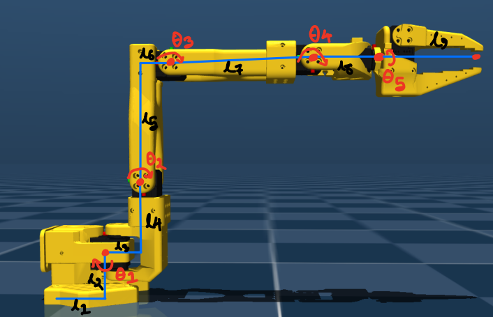

# LeRobot SO-101 Kinematics & Visual Servoing
**Kinematic modeling, DH parameters, and simulation for the LeRobot SO-101 manipulator.**

[](https://www.python.org/)
[](https://mujoco.org/)
[](https://github.com/huggingface/lerobot)
[](LICENSE)

**A modular, safety-critical control stack designed specifically for the SO-101 robotic manipulator.**

This project is a complete, ground-up implementation of fundamental robotics kinematics. Instead of relying on "black box" solvers, the kinematics engine—including Forward Kinematics and Jacobian-based velocity control—was derived analytically from scratch.

The system follows a rigorous **Sim2Real pipeline**: every control algorithm is first validated in a high-fidelity **MuJoCo** simulation to ensure stability, and then seamlessly deployed to the physical hardware using the **Hugging Face LeRobot** framework.

---

## 📸 Demo


*Deploying same code to hardware*

---

## 🚀 Key Engineering Features

### 1. Custom Kinematics Engine
* **Analytical Derivation:** Implemented Forward and Velocity Kinematics from scratch using **SymPy** and **Denavit-Hartenberg (DH)** parameters (not a black-box solver).
* **Jacobian Control:** Uses a symbolic Jacobian matrix compiled to a fast NumPy function for real-time differential inverse kinematics.

### 2. Safety-Critical Control Layer
* **Singularity Avoidance:** Real-time monitoring of the Manipulability Index ($w = \sqrt{\det(JJ^T)}$) to prevent erratic motion near singular configurations.
* **Predictive Joint Limits:** A safety filter anticipates joint limit violations *before* they happen and clamps velocity vectors dynamically.

### 3. Closed-Loop Visual Servoing
* **Computer Vision:** Integrated OpenCV pipeline for real-time object detection (Color Thresholding + Contour Analysis).
* **Visual Feedback Loop:** Implemented a Proportional (P) controller mapping pixel-space error directly to joint-space velocities via the pseudo-inverse Jacobian.

---


## 🛠️ Installation

### Prerequisites
- **OS:** Linux (Ubuntu 20.04/22.04 recommended) or Windows (WSL2 supported for Sim).
- **Hardware:** SO-101 Robot Arm, USB Camera.
- **Python:** 3.8 or higher

### 1. Clone & Install
Clone the repository and install in editable mode.

```bash
# Clone the repository
git clone https://github.com/acharjee07/lerobot-mujoco-kinematics.git
cd lerobot-mujoco-kinematics

# Install in editable mode (recommended for development)
pip install -e .
```

This will install all required dependencies including LeRobot, MuJoCo, NumPy, and other libraries.

### 2. Permissions (Linux Only)
Grant permission to access the USB serial port (for the robot) and video device (for the camera).

```bash
sudo usermod -aG dialout $USER
sudo usermod -aG video $USER
# Log out and log back in for changes to take effect!
```

## ⚙️ Configuration
Do not edit the source code to change ports! Use the configuration file: `configs/env_config.yaml`.

```yaml
# configs/env_config.yaml

robot_name: "so101_follower"  # Robot Model
port: "/dev/ttyACM0"          # USB Port (Check via 'ls /dev/tty*')
camera_index: 0               # Camera ID (0, 1, or 2)
deadband: 50                  # Visual Servoing Stop Radius (pixels)
```

### LeRobot Calibration Setup

LeRobot uses calibration files to map joint positions to motor encoder values. These JSON files contain the calibration data for your specific robot hardware.

1. **Place Calibration Files**: Copy the appropriate calibration file to LeRobot's expected location:

```bash
# For follower robot (most common)
cp calibration_files/so101_follower.json ~/.cache/huggingface/lerobot/calibration/so101_follower.json

# For leader robot (if using teleoperation)
cp calibration_files/so101_leader.json ~/.cache/huggingface/lerobot/calibration/so101_leader.json
```

**Note**: These calibration files are specific to your SO-101 robot hardware. If you have different motor configurations, you'll need to recalibrate using LeRobot's calibration tools.

## 🕹️ Usage

### 1. Simulation (Test Safety First)
Always verify your control logic in MuJoCo before turning on the motors.

```bash
# Run Velocity Control with Safety Layer in Sim
python -m src.simulation.run_sim_velocity
```

### 2. Real Hardware (Deployment)
Deploy the verified code to the physical robot.

```bash
# Run Visual Servoing (Color Tracking)
python -m src.hardware.run_visual_servoing --debug

# Run Inverse Kinematics Test
python -m src.hardware.run_real_ik
```


## 📂 Project Structure

```
lerobot-mujoco-kinematics/
├── configs/                # Runtime configurations (YAML)
├── src/
│   ├── kinematics/         # The Math Core
│   │   ├── jacobian_symbolic.py  # Symbolic Jacobian derivation
│   │   ├── velocity.py           # Numerical solver
│   │   └── forward.py            # Analytical FK
│   │
│   ├── vision/             # The Eyes
│   │   └── detector.py           # Object detection pipeline
│   │
│   ├── hardware/           # The Real World
│   │   ├── run_visual_servoing.py # Main application entry point
│   │   └── hardware_utils.py      # LeRobot interface wrapper
│   │
│   └── simulation/         # The Digital Twin
│       └── run_sim_safe_velocity.py
│
├── environment.yml         # Dependency lock file
└── setup.py                # Package definition
```

## 🔬 Mathematical Background

### 1. Robot Kinematic Skeleton
The SO-101 manipulator is modeled as a series of rigid links connected by revolute joints. The kinematic chain is defined by the link lengths ($l_1 \dots l_9$) and joint angles ($\theta_1 \dots \theta_5$) shown below.




### 2. Geometric Parameters
The following link dimensions were measured and used to derive the Denavit-Hartenberg (DH) parameters.

| Parameter | Value (meters) | Description |
| :--- | :--- | :--- |
| **$l_1$** | `0.0388` | Base horizontal offset |
| **$l_2$** | `0.0624` | Base vertical offset |
| **$l_3$** | `0.0304` | Shoulder offset (lateral) |
| **$l_4$** | `0.0542` | Shoulder offset (vertical) |
| **$l_5$** | `0.1126` | Upper arm length (primary) |
| **$l_6$** | `0.0280` | Upper arm length (secondary/offset) |
| **$l_7$** | `0.1349` | Forearm length |
| **$l_8$** | `0.0611` | Wrist length |
| **$l_9$** | `0.1034` | Gripper/Tool length |

*Note: The effective upper arm length used in calculations is $\sqrt{l_5^2 + l_6^2}$.*

### 3. Forward Kinematics (DH Parameters)
The Denavit-Hartenberg parameters are derived as follows, matching the handwritten derivation:

| Frame ($i-1 \to i$) | $a_i$ (Link Length) | $\alpha_i$ (Link Twist) | $d_i$ (Link Offset) | $\theta_i$ (Joint Angle) |
| :--- | :--- | :--- | :--- | :--- |
| **$0 \to 1$** | $l_0$ | $-\pi$ | $l_2$ | $0$ |
| **$1 \to 2$** | $l_2$ | $\pi/2$ | $-l_3$ | $\theta_1$ |
| **$2 \to 3$** | $-\sqrt{l_4^2 + l_5^2}$ | $0$ | $0$ | $\pi - \tan^{-1}(l_4/l_5) + \theta_2^*$ |
| **$3 \to 4$** | $-l_6$ | $0$ | $0$ | $\tan^{-1}(l_4/l_5) + \theta_3^*$ |
| **$4 \to 5$** | $0$ | $\pi/2$ | $0$ | $\pi/2 + \theta_4^*$ |
| **$5 \to t$** | $0$ | $-\pi/2$ | $-l_7$ | $\pi/2 - \theta_5^*$ |

*Note: $\theta^*$ denotes the active joint variable.*


### 3. Inverse Kinematics (Geometric Approach)
We derived a computationally efficient geometric solution for the first 4 DOFs. For the complete step-by-step derivation, please refer to the **[Handwritten Calculations (PDF)](docs/IK_Calculation.pdf)**.

**Base Rotation ($\theta_1$):**
Determined by projecting the target coordinate vector onto the XY plane:
$$\theta_1 = -\text{atan2}(Y, X - l_1)$$

**Planar Articulation ($\theta_2, \theta_3$):**
Using the Law of Cosines on the projection plane defined by $\theta_1$:
$$D = \frac{P^2 - L_a^2 - L_b^2}{2 L_a L_b}$$
$$\theta_3 = \text{atan2}(\sqrt{1-D^2}, D) - \beta$$
$$\theta_2 = \beta - \text{atan2}(\sqrt{1-D^2}, D) - \text{atan2}\left(Z_d, \sqrt{X_d^2 + Y_d^2}\right)$$
**Wrist Flex ($\theta_4$):**
$\theta_4$ is calculated by computing the Forward Kinematics up to Frame 4 ($H_4^W$) and enforcing a constraint that the local Y-axis must be opposite to the World Z-axis (keeping the tool horizontal).

$$H_4^W = A_1 A_2 A_3 A_4$$
$$\theta_4 = \pi - \arccos(H_4^W[2, 1])$$

*Note: $H_4^W[2, 1]$ corresponds to the Z-component (row 2) of the Y-axis vector (col 1).*

---

### 4. Differential Kinematics (Velocity Control)
For smooth trajectory tracking, we use the Jacobian matrix $J(q)$ which relates joint velocities to end-effector spatial velocities:

$$v_e = \begin{bmatrix} v \\ \omega \end{bmatrix} = J_{total}(q)\dot{q}$$

**Control Law:**
We solve for joint velocities using the Moore-Penrose pseudo-inverse with a low-pass smoothing filter ($\alpha=0.2$) to reduce hardware jitter:

$$\dot{q}_{raw} = J^{\dagger}(q) \cdot (X_{target} - X_{current})$$
$$\dot{q}_{cmd} = \alpha \cdot \dot{q}_{raw} + (1 - \alpha) \cdot \dot{q}_{prev}$$

---

### 5. Simplified 2D Visual Servoing
We implemented an Image-Based Visual Servoing (IBVS) controller that maps 2D pixel error directly to 3D base velocity, locking the depth axis.

**Pixel Error:**

$$
e = \begin{bmatrix} u - c_x \\\\ v - c_y \end{bmatrix}
$$

Where $(u, v)$ is the object centroid and $(c_x, c_y)$ is the camera optical center.

**Velocity Mapping:**
The camera-frame error is transformed into a base-frame velocity command:

$$
v_{base} = R_{0}^{EE} \cdot R_{cam}^{EE} \cdot \begin{bmatrix} -k_x \cdot e_x \\\\ -k_y \cdot e_y \\\\ 0 \end{bmatrix}
$$

This vector $v_{base}$ is then fed into the Differential Kinematics solver to drive the robot.

## 📜 License

This project is open-source under the Apache 2.0 License.

## 🤝 Acknowledgments

- **[iSET Lab](https://iset-lab.github.io/):** This project was developed as part of my research at the **Intelligent Systems and Emerging Technologies (iSET) Lab** at the University of Texas at Arlington. Special thanks to the lab and my supervisor for providing the hardware and resources necessary for this project.
- **Hugging Face LeRobot** for the excellent hardware abstraction layer.
- **MuJoCo** for the physics engine.

